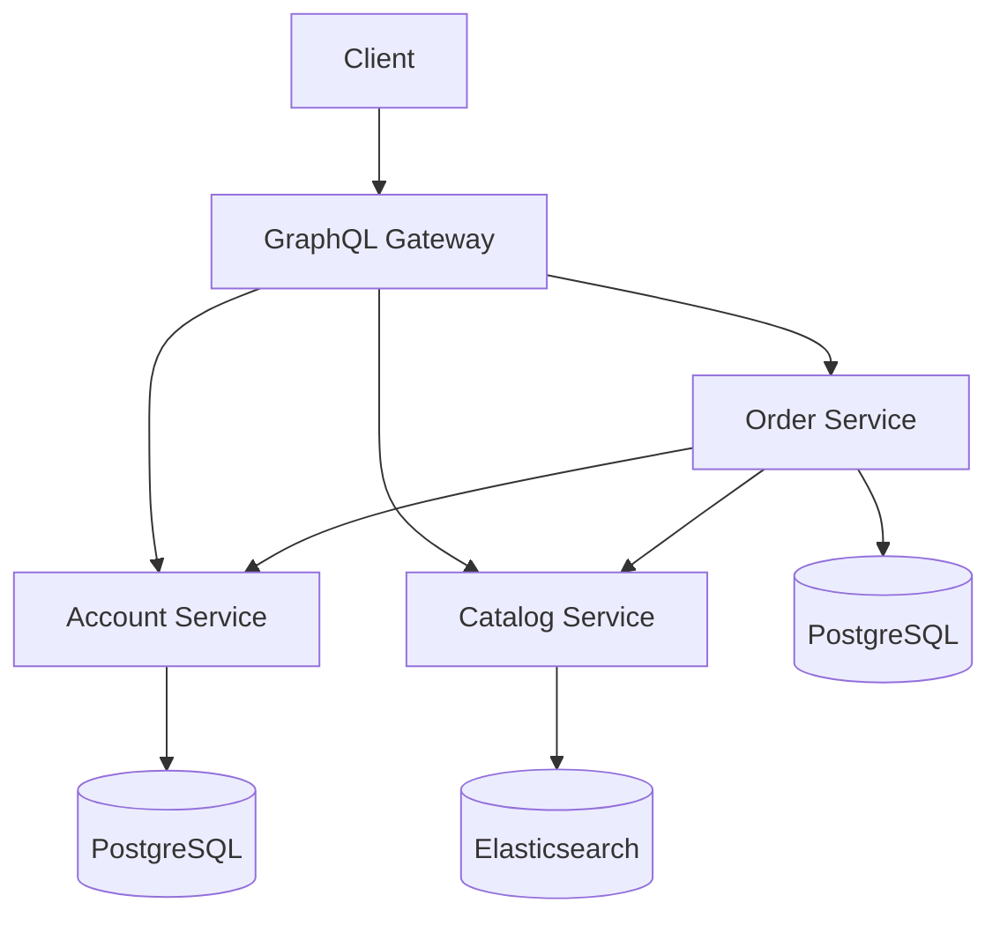
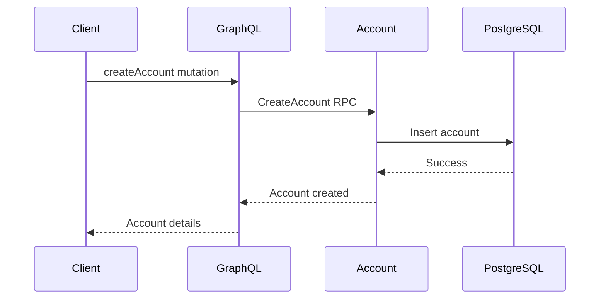
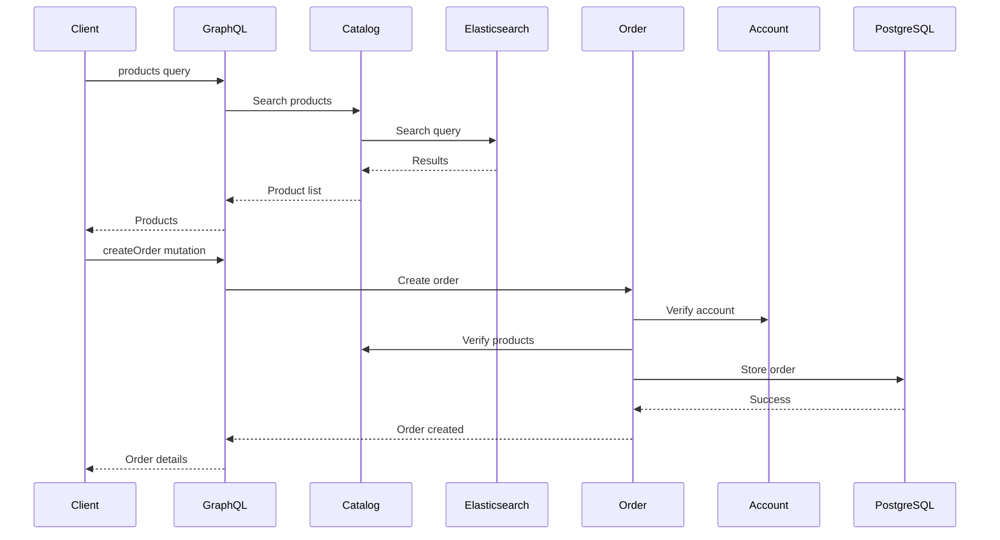

# Architecture Overview

The Go Marketplace is built using a microservices architecture, with each service responsible for a specific domain of the application.

## System Components

### 1. GraphQL Gateway (Port 8080)
- Acts as the API Gateway for the entire system
- Implements a GraphQL API using gqlgen
- Aggregates data from multiple microservices
- Handles request routing and composition
- Technologies:
  - Go
  - gqlgen
  - CORS middleware
  - GraphQL Playground

### 2. Account Service (Port 8081)
- Manages user accounts and authentication
- Stores account data in PostgreSQL
- Exposes gRPC endpoints for account operations
- Technologies:
  - Go
  - gRPC
  - PostgreSQL
  - KSUID for ID generation

### 3. Catalog Service (Port 8082)
- Manages product catalog and search
- Uses Elasticsearch for product storage and search
- Exposes gRPC endpoints for product operations
- Technologies:
  - Go
  - gRPC
  - Elasticsearch 7.x
  - Full-text search capabilities

### 4. Order Service (Port 8083)
- Handles order processing and management
- Stores order data in PostgreSQL
- Communicates with Account and Catalog services
- Technologies:
  - Go
  - gRPC
  - PostgreSQL
  - KSUID for ID generation

## Service Communication



### Communication Patterns
1. **Client to Gateway**
   - HTTP/GraphQL
   - Playground for testing
   - CORS enabled

2. **Inter-service Communication**
   - gRPC for all service-to-service communication
   - Protocol Buffers for message serialization
   - Bi-directional streaming support

3. **Service to Database**
   - PostgreSQL for structured data (accounts, orders)
   - Elasticsearch for search-optimized data (products)

## Data Flow

### 1. Account Creation


### 2. Product Search and Order


## Database Schema

### Account Service (PostgreSQL)
```sql
CREATE TABLE accounts (
    id VARCHAR PRIMARY KEY,
    name VARCHAR NOT NULL,
    created_at TIMESTAMP NOT NULL DEFAULT CURRENT_TIMESTAMP
);
```

### Order Service (PostgreSQL)
```sql
CREATE TABLE orders (
    id VARCHAR PRIMARY KEY,
    account_id VARCHAR NOT NULL,
    total_price DECIMAL(10,2) NOT NULL,
    created_at TIMESTAMP NOT NULL DEFAULT CURRENT_TIMESTAMP
);

CREATE TABLE order_items (
    order_id VARCHAR NOT NULL,
    product_id VARCHAR NOT NULL,
    quantity INTEGER NOT NULL,
    price DECIMAL(10,2) NOT NULL,
    PRIMARY KEY (order_id, product_id)
);
```

### Catalog Service (Elasticsearch)
```json
{
  "mappings": {
    "properties": {
      "id": { "type": "keyword" },
      "name": { "type": "text" },
      "description": { "type": "text" },
      "price": { "type": "float" },
      "created_at": { "type": "date" }
    }
  }
}
```

## Error Handling and Resilience

1. **Circuit Breaking**
   - Services implement retry mechanisms
   - Timeouts are configured for all operations
   - Failed operations are logged and monitored

2. **Data Consistency**
   - Each service maintains its own database
   - Eventual consistency between services
   - Transactions within service boundaries

3. **Service Discovery**
   - Docker Compose for local development
   - Service URLs configured via environment variables
   - Health checks for all services

## Deployment

The application is containerized using Docker and can be deployed using:
- Docker Compose for local development
- Kubernetes for production (configuration not included)
- Cloud-native services (AWS, GCP, Azure)

### Container Configuration
- Each service has its own Dockerfile
- Services are built from the same base Go image
- Minimal runtime images using multi-stage builds
- Environment-based configuration

## Monitoring and Logging

1. **Logging**
   - Structured logging using Go's log package
   - Service name and request ID in log entries
   - Error details and stack traces when appropriate

2. **Metrics**
   - Request latency
   - Error rates
   - Database connection pool stats
   - Cache hit/miss rates

## Security

1. **Network Security**
   - Internal services not exposed externally
   - CORS configuration for the GraphQL API
   - TLS support (not configured in development)

2. **Data Security**
   - Password hashing (when implemented)
   - Input validation at all layers
   - SQL injection prevention
   - NoSQL injection prevention

## Future Improvements

1. **Authentication and Authorization**
   - Implement JWT-based authentication
   - Role-based access control
   - API key management

2. **Performance**
   - Implement caching layer
   - Query optimization
   - Connection pooling

3. **Scalability**
   - Horizontal scaling configuration
   - Load balancing
   - Service mesh integration 